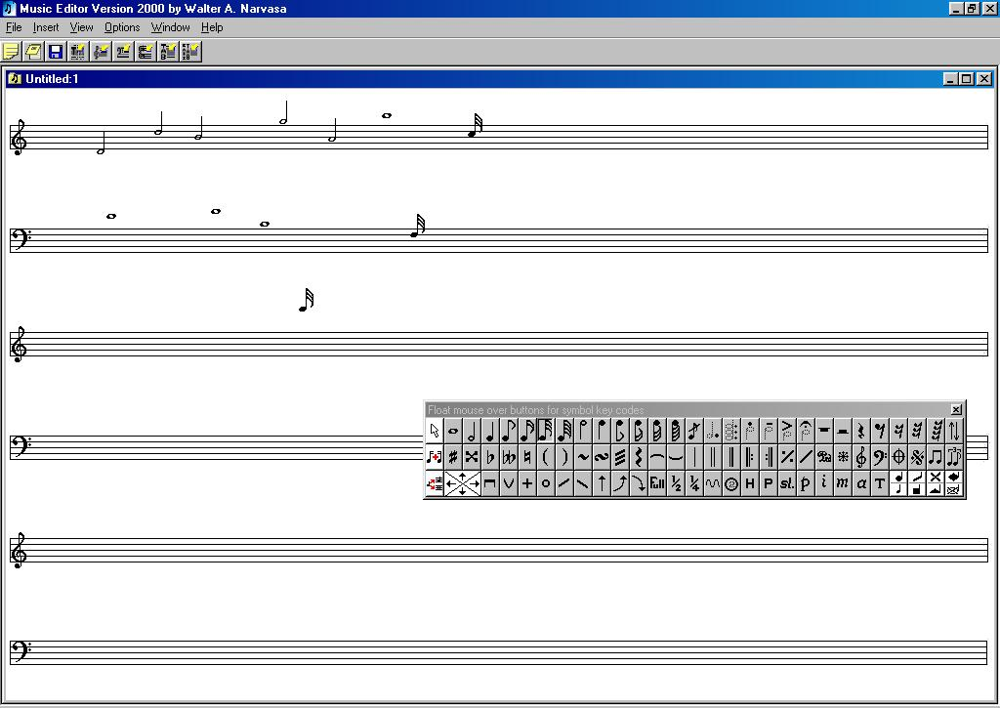



## MUSIC EDITOR Version 2000 \(A musical note editor\.\.a must see\.\.\)

### Description

In this sample code of mine, you can learn how to control arrays and used it in a more sufficient way of programming. You can SAVE/EDIT/INSERT/PRINT the notes you already designed. If you like this code..just vote for it!! Have fun with this code!
 
### More Info
 

             |
---                |---
**Submitted On**   |2001-03-16 10:11:22
**By**             |[Walter Narvasa](https://github.com/Planet-Source-Code/PSCIndex/blob/master/ByAuthor/walter-narvasa.md)
**Level**          |Advanced
**User Rating**    |4.9 (78 globes from 16 users)
**Compatibility**  |VB 6\.0
**Category**       |[Complete Applications](https://github.com/Planet-Source-Code/PSCIndex/blob/master/ByCategory/complete-applications__1-27.md)
**World**          |[Visual Basic](https://github.com/Planet-Source-Code/PSCIndex/blob/master/ByWorld/visual-basic.md)
**Archive File**   |[CODE\_UPLOAD171283162001\.zip](https://github.com/Planet-Source-Code/walter-narvasa-music-editor-version-2000-a-musical-note-editor-a-must-see__1-21680/archive/master.zip)

